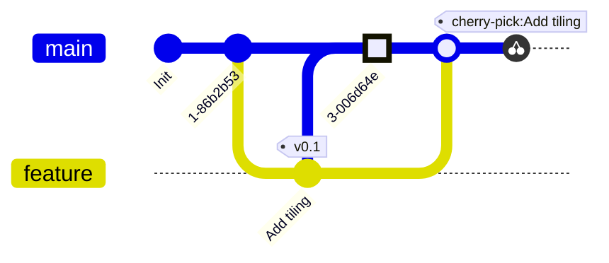
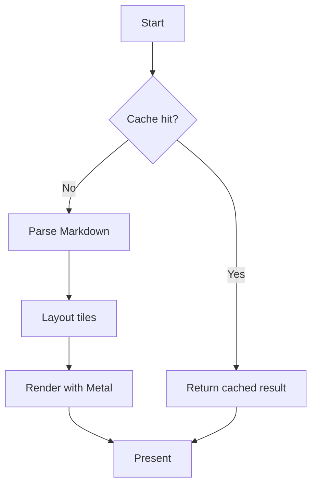
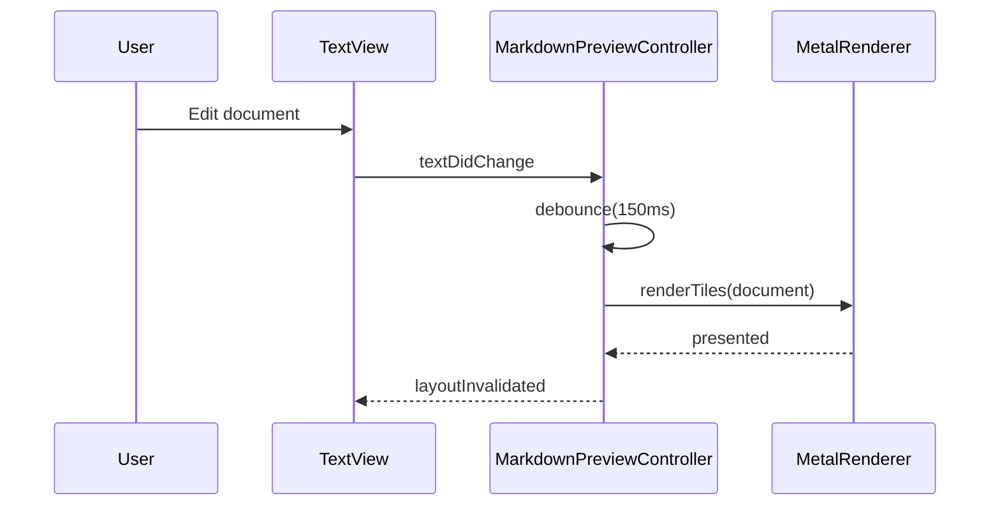
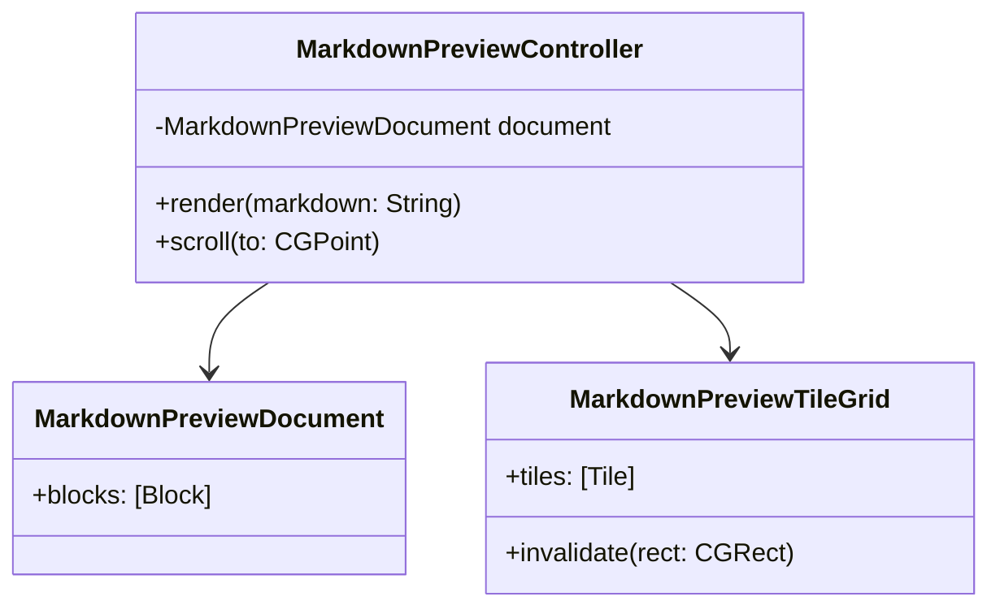
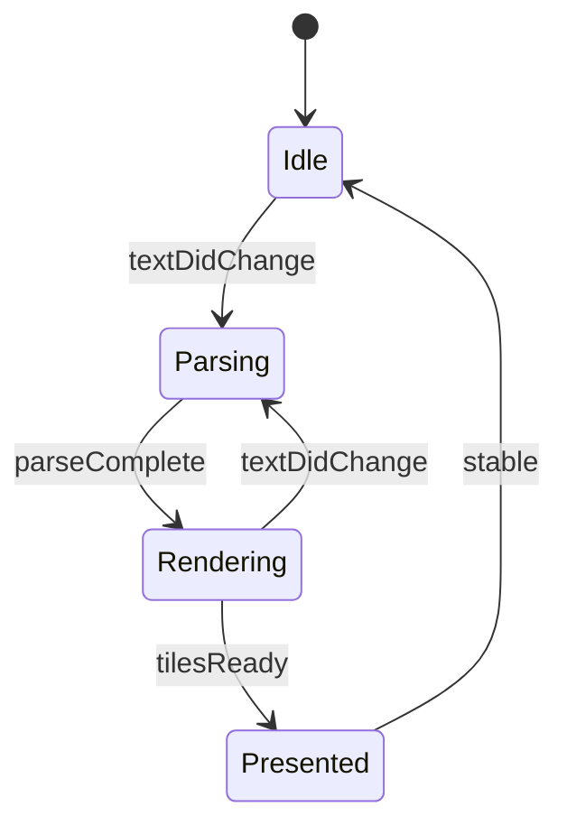
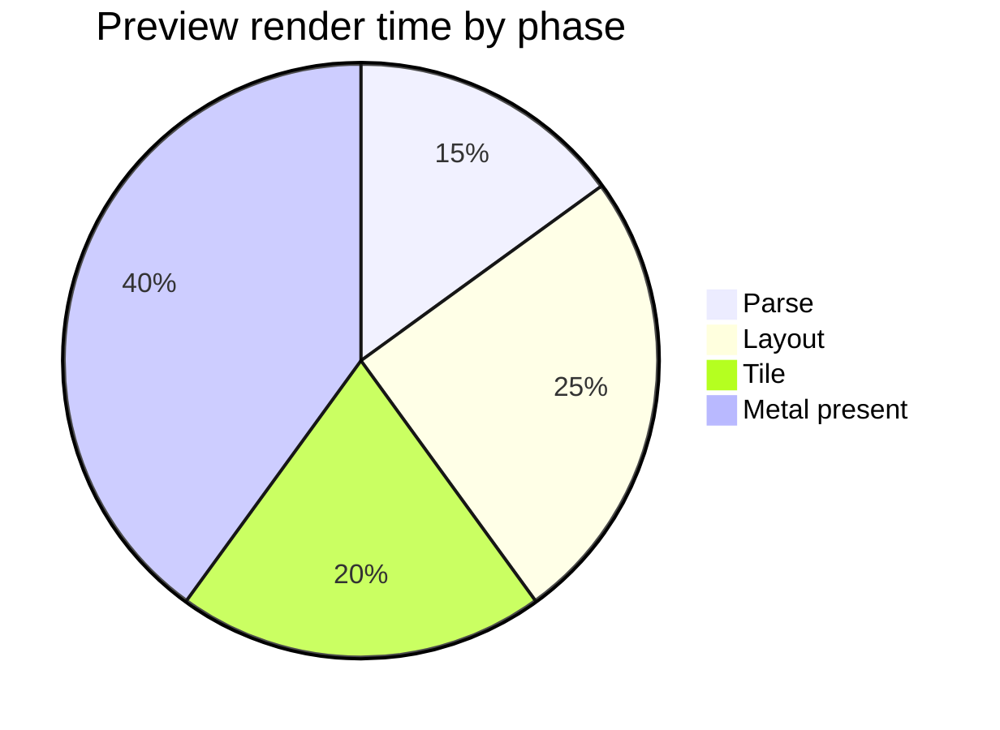
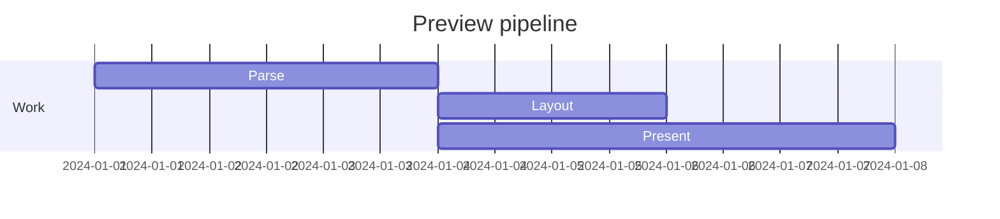
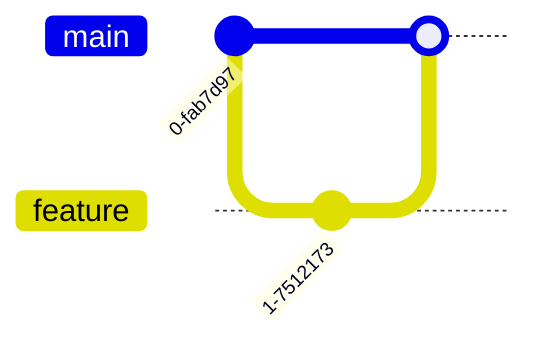
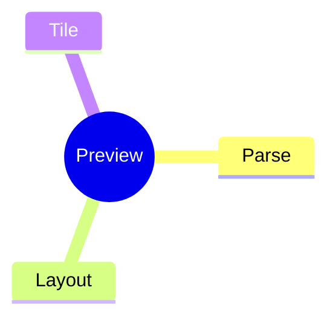
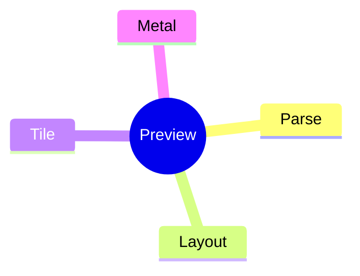

# Markdown Preview Test Document

This file exercises every feature the Umbra Markdown preview pane is expected to
render, for a visual smoke test after any changes to `MarkdownPreview*.swift`.

## Table of contents

- [Headings](#headings)
- [Emphasis](#emphasis)
- [Lists](#lists)
- [Links & images](#links--images)
- [Blockquotes](#blockquotes)
- [Code](#code)
- [Tables](#tables)
- [Mermaid diagrams](#mermaid-diagrams)
- [Horizontal rules](#horizontal-rules)
- [Misc inline](#misc-inline)

---

## Headings

# H1 heading
## H2 heading
### H3 heading
#### H4 heading
##### H5 heading
###### H6 heading

## Emphasis

Plain text, *italic text*, _also italic_, **bold text**, __also bold__,
***bold italic***, ~~strikethrough~~, and `inline code` all in one paragraph.

A line with a  
hard break (two trailing spaces) above, and a soft
wrap continuing here.

## Lists

Unordered:

- First item
- Second item with **bold** and `code`
  - Nested item A
  - Nested item B
    - Deeply nested item
- Third item

Ordered:

1. Preheat the oven
2. Mix ingredients
   1. Dry ingredients first
   2. Then wet ingredients
3. Bake for 25 minutes

Task list:

- [x] Render headings
- [x] Render tables
- [ ] Render mermaid diagrams
- [ ] Ship it 🚀

## Links & images

An [inline link](https://example.com/docs) and a [reference link][ref-1], plus
a bare autolink <https://example.com>.

An image (may not resolve locally, tests broken-image handling):


[ref-1]: https://example.com/reference "Reference Title"

## Blockquotes

> Single-level blockquote with **bold** text and `inline code`.
>
> Second paragraph in the same blockquote.

> Outer quote
>> Nested quote
>>> Triple-nested quote

## Code

Inline: use `MarkdownPreviewController.render(_:)` to trigger a re-render.

Fenced, no language:

```
plain fenced block
no syntax highlighting
    indentation preserved
```

Swift:

```swift
struct MarkdownPreviewStyle {
    var fontSize: CGFloat = 13
    var lineSpacing: CGFloat = 4

    func codeFont() -> NSFont {
        NSFont.monospacedSystemFont(ofSize: fontSize, weight: .regular)
    }
}

final class MarkdownPreviewController {
    private var document: MarkdownPreviewDocument?

    func render(_ markdown: String) {
        document = MarkdownPreviewDocument(parsing: markdown)
        layoutDidChange()
    }
}
```

JavaScript:

```javascript
function renderTile(grid, index) {
  const { x, y, width, height } = grid.tiles[index];
  return { x, y, width, height, dirty: true };
}

const tiles = Array.from({ length: 16 }, (_, i) => renderTile(grid, i));
console.log(`rendered ${tiles.length} tiles`);
```

Python:

```python
def fibonacci(n: int) -> list[int]:
    seq = [0, 1]
    while len(seq) < n:
        seq.append(seq[-1] + seq[-2])
    return seq[:n]

for value in fibonacci(10):
    print(value, end=" ")
```

Bash:

```bash
#!/usr/bin/env bash
set -euo pipefail

swift build --product Umbra
swift test --filter MarkdownPreviewTests
echo "done"
```

JSON:

```json
{
  "name": "markdown-preview-test",
  "features": ["tables", "mermaid", "code", "task-lists"],
  "enabled": true,
  "priority": 1
}
```

YAML:

```yaml
theme: default
preview:
  renderer: metal
  tiling: true
  maxTileHeight: 4096
```

Diff:

```diff
- func oldRenderer() -> Bool { false }
+ func metalRenderer() -> Bool { true }
  func shared() -> Int { 42 }
```

## Tables

| Feature          | Status | Notes                          |
|------------------|:------:|---------------------------------|
| Headings         |   ✅   | H1–H6                          |
| Tables           |   ✅   | Alignment variants below        |
| Mermaid          |   🚧   | Tiled Metal rendering           |
| Code fences      |   ✅   | Multi-language highlighting     |
| Task lists       |   ✅   | Checked / unchecked             |

Alignment test:

| Left aligned | Center aligned | Right aligned |
|:-------------|:--------------:|--------------:|
| a            |        b        |             c |
| longer cell  |       mid        |       1234.56 |
| x            |        y        |             z |

## Mermaid diagrams

Git graph:



Flowchart:



Sequence diagram:



Class diagram:



State diagram:



Pie chart:



Gantt:



Git graph:



Mindmap:



Radial layout (via frontmatter):



## Horizontal rules

Above the rule.

---

Between rules.

***

Below the second rule.

## Misc inline

Emoji: 🎉 ✅ 🚧 🐛 💡

Footnote reference[^1] inline, a second one[^later-defined] referencing a definition that appears
before this paragraph, and an undefined one[^missing] that should stay as literal text.

Superscript-ish math note: E = mc^2 (not rendered as LaTeX, plain text expected).

[^later-defined]: Defined out of order — should still be numbered by where it's *referenced*, not
    where it's defined. This line also has a wrapped, indented continuation.
[^1]: This is the footnote text, with a lazy continuation line
right below it that should join the same paragraph.
[^unused]: Never referenced from the body — should still show up in the Footnotes section rather
    than silently vanish.

---

*End of test document — if every section above rendered without errors, missing
sections, or a blank Metal canvas, the preview pane is healthy.*
