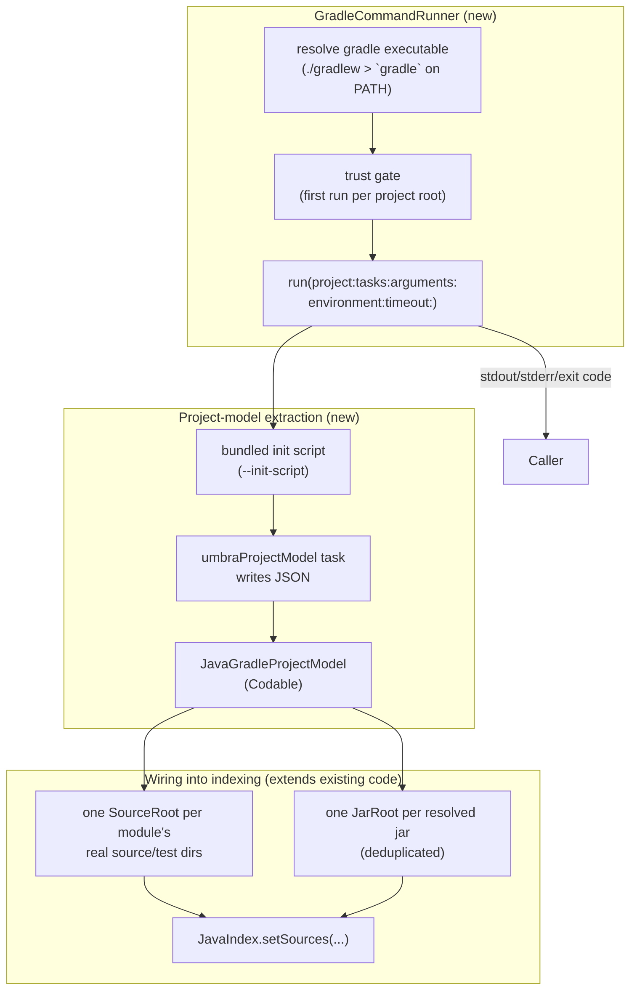

# Handoff: Gradle Project & Subproject Support for Umbra's Java Completion

This document specifies the plan to take Umbra's Java completion (see
[`Sources/JavaIntelligence`](../Sources/JavaIntelligence), built on the `java-completion` branch)
from "opens a Gradle project folder and completes the JDK + your own source" to "understands the
project as Gradle understands it" -- multi-module aware, with real dependency completion.

## 0. Where things stand today

Umbra can already open a Gradle project folder like any other folder: the file tree shows
`build.gradle`, `settings.gradle`, `src/main/java/...`, and Java completion works for JDK classes
and the project's own source files. What's missing is everything Gradle itself knows about the
project that a flat directory walk can't see: module boundaries, per-module source sets, and
resolved dependencies. Concretely:

- [`SourceRoot`](../Sources/JavaIntelligence/Scanning/SourceRoot.swift) walks the *entire* folder
  tree for `.java` files (skipping `.git`/`build`/`.gradle`/etc. by name --
  `SourceRoot.ignoredDirectoryNames`, line 19), with no idea that `:app` and `:lib:core` are
  different modules or that a module might use non-conventional source directories. It happens to
  work today only because a single project's dependencies are also not yet module-scoped -- there's
  nothing to get wrong yet.
- No JAR ever reaches `JavaIndex`. `IDEJavaSupport.publishSources()`
  ([`Example/Umbra/IDEJavaSupport.swift:94-97`](../Example/Umbra/IDEJavaSupport.swift)) already
  reserves precedence `2` for JARs (`0 = overlay, 1 = project sources, 2 = JARs, 3 = JDK`, per
  [`JavaIndex.swift:9`](../Sources/JavaIntelligence/Index/JavaIndex.swift)) but nothing ever
  populates it.
- There's no dedicated way to run a Gradle command at all, structured or not.

## 1. The dedicated Gradle execution tool

Build one reusable piece first, independent of dependency resolution: a tool that runs an arbitrary
Gradle invocation and gives back its output reliably. Everything else (subproject/dependency
extraction now, `build`/`test`/custom tasks later) is a call through it.



### `GradleCommandRunner`

New file: `Sources/JavaIntelligence/Gradle/GradleCommandRunner.swift`.

- **Executable resolution**: prefer the project's own `./gradlew`/`gradlew.bat` (respects the
  version the project is pinned to, matching what a human running `./gradlew` at a terminal would
  get); fall back to `gradle` resolved through a login shell (`/bin/zsh -lc 'command -v gradle'`,
  the same reasoning as `SystemProcessRunner` resolving `/usr/libexec/java_home` -- GUI apps get a
  minimal `PATH`).
- **A generic entry point**, not a dependency-resolution-specific one:
  ```swift
  struct GradleCommandResult: Sendable {
      let exitCode: Int32
      let stdout: String
      let stderr: String
  }

  actor GradleCommandRunner {
      func run(
          projectDirectory: URL, tasks: [String], arguments: [String] = [],
          javaHome: URL?, timeout: Duration = .seconds(120)
      ) async throws -> GradleCommandResult
  }
  ```
  This is the "dedicated tool to execute gradle commands" -- reusable later for `build`, `test`, a
  `clean`, or any other task, not just this handoff's model-extraction task.
- **Extends, doesn't reuse as-is, `ProcessRunning`**
  ([`JDKLocator.swift:127-160`](../Sources/JavaIntelligence/Discovery/JDKLocator.swift)):
  that protocol's `run(executable:arguments:currentDirectory:environment:) throws -> String` is
  synchronous and blocks until the process exits with no cancellation or timeout -- fine for a
  sub-second `java_home -X`, wrong for a Gradle invocation that can hang on a first-run dependency
  download with no network. `GradleCommandRunner` needs its own `Process`-based implementation with
  real timeout (kill the process group on expiry) and `Task` cancellation support, but should keep
  the same "protocol + fake for tests" shape `ProcessRunning`/`FakeProcessRunner` already
  established in `JDKLocatorTests.swift` so command construction and argument handling are testable
  without spawning a real Gradle daemon.
- **Trust gate**: Gradle build scripts run arbitrary code the moment any task is invoked, `gradlew`
  or not (documented as a known concern in the original Java-completion plan too). Add a small
  trust store -- a `Set<String>` of trusted, `standardizedFileURL`-normalized project root paths,
  persisted under `JavaIndexPaths.default().root` (or alongside `IDEPreferences`) -- and refuse to
  run anything for a root that isn't in it. Umbra prompts once per root ("Trust and run Gradle
  build scripts for this project?", mirroring IntelliJ's own dialog) and remembers the answer.

### Structured, multi-module project extraction

Do **not** parse `./gradlew :app:dependencies` free text (what the original Java-completion plan
sketched before this handoff). It's fragile across Gradle versions and configurations, doesn't
naturally walk subprojects, and doesn't give source directories at all. Instead, inject a small
bundled init script via `--init-script` that uses Gradle's *own* APIs to write structured JSON:

New resource: `Sources/JavaIntelligence/Gradle/Resources/umbra-project-model.init.gradle` (Groovy,
not Kotlin DSL -- Groovy init scripts don't need the `kotlin-dsl` plugin resolved first, which
keeps this working on older Gradle versions with no extra setup). It defines one task,
`umbraProjectModel`, that:

1. Walks `rootProject.allprojects` -- this is what makes subproject support fall out for free
   instead of being bolted on afterward.
2. For each project, collects:
   - its path (`:app`, `:lib:core`, ...) and `projectDir`
   - `sourceSets.main.java.srcDirs` and `sourceSets.test.java.srcDirs` (plus any custom source
     sets present) -- the piece `SourceRoot`'s blind walk can't get right on its own
   - the Java toolchain / `sourceCompatibility` (for JDK feature-version selection, feeding
     `JDKLocator.select(minimumFeatureVersion:)`,
     [`JDKLocator.swift:66`](../Sources/JavaIntelligence/Discovery/JDKLocator.swift))
   - resolved `compileClasspath`/`testCompileClasspath` artifact files, via
     `configurations.compileClasspath.resolvedConfiguration.lenientConfiguration.artifacts` --
     `lenientConfiguration` specifically, so one unresolvable dependency degrades gracefully
     instead of failing the whole model (the same posture as `JavaLocalScope`'s `ERROR`-node
     fallback and `ClassFileReader`'s per-member `try?` reads elsewhere in this codebase). These
     are **already-resolved absolute file paths** sitting in `~/.gradle/caches` or `~/.m2` --
     Gradle did the coordinate-to-path resolution; nothing here needs to re-derive it.
3. Writes it all as one JSON document to a path passed in as a project property
   (`-PoutputFile=...`), invoked as:
   ```
   ./gradlew umbraProjectModel -PoutputFile=/tmp/.../model.json --init-script umbra-project-model.init.gradle
   ```
   through `GradleCommandRunner.run(...)`.

New file: `Sources/JavaIntelligence/Gradle/JavaGradleProjectModel.swift` -- `Codable` structs
matching that JSON:

```swift
struct JavaGradleProjectModel: Codable, Sendable {
    struct Subproject: Codable, Sendable {
        let path: String            // ":app", ":lib:core"
        let directory: URL
        let sourceDirs: [URL]
        let testSourceDirs: [URL]
        let languageLevel: Int?
        let compileClasspathJars: [URL]
        let testClasspathJars: [URL]
    }
    let subprojects: [Subproject]
}
```

### Wiring the model into indexing

Extends `IDEJavaSupport` ([`Example/Umbra/IDEJavaSupport.swift`](../Example/Umbra/IDEJavaSupport.swift))
and reuses pieces that already exist rather than replacing them:

- One [`SourceRoot`](../Sources/JavaIntelligence/Scanning/SourceRoot.swift) per subproject's real
  `sourceDirs`/`testSourceDirs` (that type already just takes a `directory: URL` -- point several
  instances at the model's directories instead of one instance at the project root).
- One [`JarRoot`](../Sources/JavaIntelligence/Scanning/JavaIndexableRoot.swift) (already handles
  multi-release JARs correctly) per unique resolved jar path across every subproject
  (`Set<URL>` dedup -- shared dependencies between modules shouldn't be indexed twice), written to
  [`JavaIndexPaths.jarShard(_:)`](../Sources/JavaIntelligence/Storage/JavaIndexPaths.swift#L30),
  precedence `2`.
- `IDEJavaSupport.setProjectRoot(_:)` detects `settings.gradle(.kts)` / `build.gradle(.kts)` /
  `gradlew` at the opened folder; if present *and* trusted, runs the model extraction through
  `GradleCommandRunner` in the background before falling back to today's single whole-tree
  `SourceRoot` (which stays as the behavior for a non-Gradle folder, or a Gradle folder the user
  hasn't trusted yet, or while the very first sync is still running -- never a regression, only
  additive).
- [`JavaIndexScheduler`](../Sources/JavaIntelligence/Scanning/JavaIndexScheduler.swift) already
  indexes a list of `(root, shardURL)` pairs concurrently and skips unchanged ones by stamp --
  feed it the whole per-subproject `SourceRoot` + `JarRoot` list in one call rather than looping
  calls to `index(_:)` sequentially.

## 2. Umbra UX

- **Trust prompt**: a sheet the first time a Gradle project opens (see the trust gate above).
- **Status bar**: reuse the `statusMessage` property already on `IDEJavaSupport`
  ([`IDEJavaSupport.swift:29-33`](../Example/Umbra/IDEJavaSupport.swift), currently computed but
  never actually surfaced in the UI -- the previous handoff flagged this as an open follow-up too).
  States: "Resolving Gradle project…", "Indexing N dependencies…", and a distinct error state
  (captured `stderr` from the last `GradleCommandRunner` run, shown on click) instead of silently
  falling back with no explanation.
- **Commands** (command palette + menu): **Java: Reload Gradle Project** (re-run extraction +
  re-index -- needed after editing `build.gradle` or pulling new code) and **Java: Show Gradle
  Output** (the last run's captured stdout/stderr, for diagnosing a failed sync).
- **Re-sync trigger**: watch `build.gradle(.kts)`, `settings.gradle(.kts)`, `gradle.properties`,
  `gradle/libs.versions.toml`, and `gradle/wrapper/gradle-wrapper.properties` for changes (a second,
  narrow [`FSEventsFileSystemWatcher`](../Sources/JavaIntelligence/Scanning/FSEventsFileSystemWatcher.swift)
  instance, or generalize that type beyond its current `.java`-only filter). On a change, prompt
  ("Build files changed — reload Gradle project?") rather than auto-resyncing --  a Gradle sync can
  be slow, so triggering it on every keystroke-adjacent save would be disruptive, matching how
  IntelliJ surfaces this as a dismissible banner rather than an automatic action.
- **Preferences**: `javaGradleAutoSync` (default on, still gated by trust) and
  `javaGradleSyncTimeoutSeconds`, alongside the existing Java preferences.

## 3. Testing

Follow the patterns already established in `Tests/PenumbraTests/JavaIntelligence`:

- **`GradleCommandRunnerTests`**: command/argument/executable-resolution construction, using a fake
  process runner the same way `JDKLocatorTests.FakeProcessRunner`
  (`Tests/PenumbraTests/JavaIntelligence/JDKLocatorTests.swift`) does -- no real Gradle invocation
  needed for this layer. Cover: preferring `./gradlew` over `gradle` on `PATH`, timeout firing and
  killing the process, cancellation, and the trust gate refusing an untrusted root.
- **`JavaGradleProjectModelTests`**: decode captured fixture JSON (checked in under
  `Tests/PenumbraTests/Fixtures/Gradle/`, one for a single-module project, one for a multi-module
  one with a shared dependency across subprojects) into `JavaGradleProjectModel` -- no Gradle
  needed here either.
- **`GradleProjectIntegrationTests`** (opt-in, `XCTSkip`-gated on no `gradle`/`gradlew` + no JDK
  found -- same posture as `TestJDK.discovered`-gated tests elsewhere in this suite): generate a
  small throwaway multi-module Gradle project in a temp directory at test time (root + two
  subprojects, one depending on the other, one depending on a single small, already-cached-or-local
  jar to avoid a network dependency in CI), run the real `GradleCommandRunner` + init script against
  it, and assert the decoded model has the right subproject paths, source directories, and resolved
  jar(s).
- **End-to-end wiring**: extend `JavaIndexSchedulerTests`/`JavaIndexTests`-style tests (already
  proven against a real JDK via `TestJDK.discovered`) to confirm a class from the resolved
  dependency jar is queryable through `JavaIndex` after the model-driven `JarRoot`s are indexed --
  mirrors `JavaIndexableRootTests.testJDKCtSymRootIndexesJavaLangString`.

## 4. Suggested milestone order

1. `GradleCommandRunner` alone (executable resolution, trust gate, timeout/cancellation, tests) --
   provable independently of anything Gradle-model-specific: "can this tool reliably run
   `./gradlew tasks` and capture its output."
2. The init script + `JavaGradleProjectModel` JSON round-trip, tested against fixture JSON only.
3. The opt-in real-Gradle integration test against a generated throwaway project.
4. Rewire `SourceRoot`/`IDEJavaSupport` around the model (per-module roots + `JarRoot`s), with the
   graceful fallback to today's whole-tree behavior preserved.
5. Umbra UX: trust prompt, status bar, reload/show-output commands, build-file watcher + prompt,
   preferences.

Steps 1-3 have no Umbra/UI dependency and are fully testable in isolation; 4 and 5 are additive to
existing, already-tested code (`SourceRoot`, `JarRoot`, `JavaIndexScheduler`, `IDEJavaSupport`)
rather than a rewrite of it.

## Implementation notes

Shipped on `java-completion`. Deviations from the literal handoff, where Gradle 9 (what's installed here) or the way Umbra is packaged made the original approach fragile:

1. **Trust store location.** `~/Library/Application Support/com.umbra.editor/gradle-trust.json`, next to `session.json`, not under `JavaIndexPaths` (that root is in Caches and versioned by shard format, so trust would silently reset on a format bump). Declined roots are stored too, so Umbra doesn't re-ask every launch; Reload asks again.
2. **Init script is a Swift string**, not a `Bundle.module` resource. `Scripts/build-app.sh` never copies SPM resource bundles into `Umbra.app`, and `JavaIntelligence` has no resources.
3. **Per-project fragment tasks.** Each project registers `umbraProjectModelFragment` and resolves only its own configurations. A root `umbraProjectModel` task depends on every fragment and writes one `model.json`. A single root task that walks `allprojects` and resolves other projects' configurations is deprecated in Gradle 8 and rejected by Gradle 9.
4. **`artifactView { lenient(true) }`** instead of `resolvedConfiguration.lenientConfiguration`. Project-component artifacts are recorded as source-set dependencies rather than indexed as jars (so a stale `build/libs/*.jar` is not a completion source). External jars are. Unresolved dependencies are listed on the model as `unresolved` and shown in the Gradle output panel.
5. **Paths are `file://` URIs**, and the model also carries `formatVersion` and `gradleVersion`, so `Codable`'s `URL` decoding produces file URLs.
6. **Session restore** routes the bookmarked root through the same path as Open Folder (`applyProjectRoot`), so a restored Gradle project syncs instead of only rebuilding the sidebar.
7. **One index, scoped queries.** Every source directory and jar is still indexed once into one `JavaIndex`. Completion passes a query scope for the source set that contains the file: that set's compile classpath, its own sources, and the source sets of its project dependencies. A file that isn't in a source set stays unscoped. `runtimeOnly` is not on the compile classpath. Format version 2 replaced the flat `sourceDirs` / `compileClasspathJars` fields with `sourceSets`.
8. **Not adopted from IntelliJ.** No Tooling API, no `DataNode` module model, no `-sources.jar` download, and sync does not run tasks that generate sources. Directories Gradle has already registered on a source set are included.
9. **JDK for Gradle vs JDK for the project.** The Gradle process itself gets the newest installed JDK (`Gradle 9` needs 17+). The indexed JDK is re-selected only when `maxLanguageLevel` would pick a different installation than the one already indexed.
